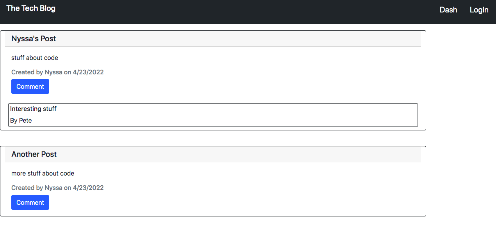
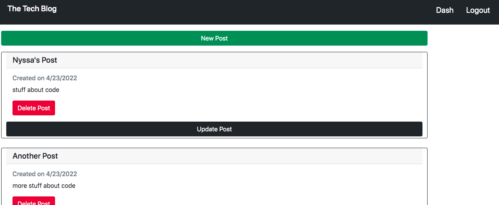

# The Tech Blog

## Table of Contents

- [Pictures](#pictures)
- [Description](#description)
- [License](#license)
- [Installation](#installation)
- [Usage](#usage)

## Pictures
Homepage

Dashboard

## Description

This is a full-stack web application with which a user can make posts, delete or update them, and comment on others' posts.

## License

None

## Installation

The application can be used by anyone with the URL, or by forking the repository and duplicating it.

## Usage

Starting at the homepage, a user can see all existing posts. By clicking the login button, they are prompted to sign up for an account, and then they can see their personal dashboard, from which they can make, update, and delete their posts. A user must also have an account in order to comment on others' posts.

## Deployed Application
https://peaceful-reaches-79315.herokuapp.com/

## For Questions
Email: rd.hart@outlook.com